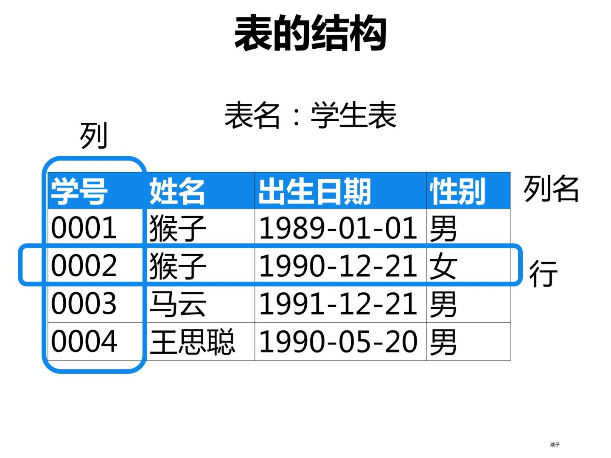
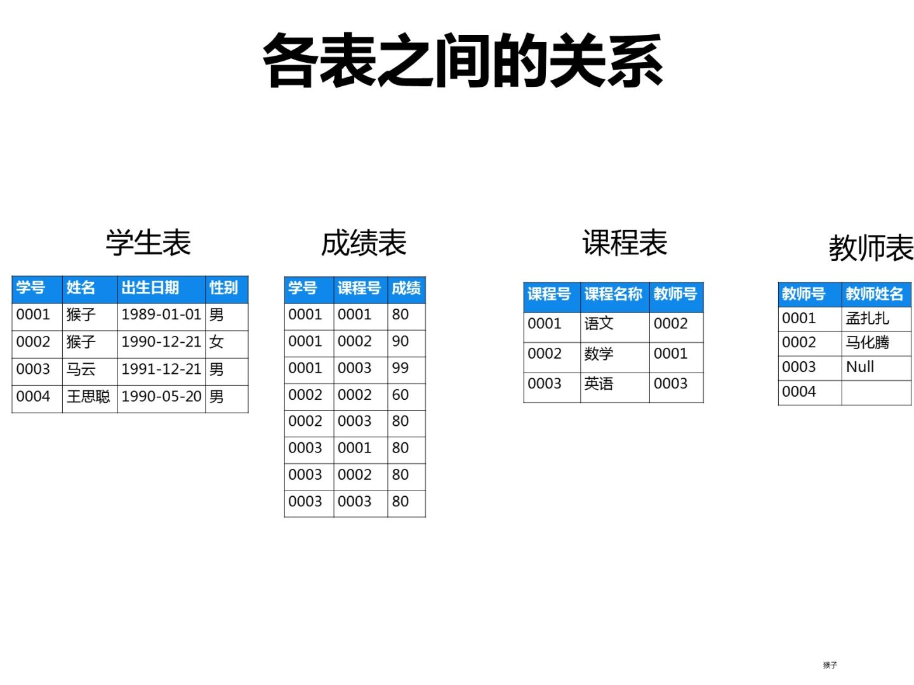
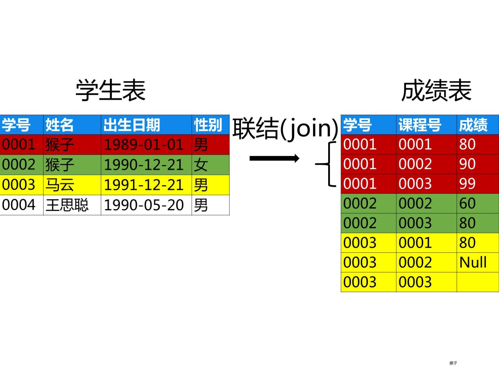

# Welcome to SQL summarization
For Xiao

## 1. 什么是数据库
数据库有很多种类，这里我们重点学习使用最广泛的关系数据库。
关系数据库是由多个表组成的。如果你用过Excel，就会知道Excel是一张一张的二维表。每个表都是由行和列组成的
同样的，关系数据库里存放的也是一张一张的表，只不过各个表之间是有联系的。所以，简单来说：
>**关系数据库=多张表+各表之间的关系**

### 表的结构
每个表由一个名字标识。表包含带有列名的列，和记录数据的行。下面图片里的表名是：学生表，记录了每个学生的信息。<br>


### 表之间的关系
每个表由一个名字标识。表包含带有列名的列，和记录数据的行。下面图片里的表名是：学生表，记录了每个学生的信息。<br>


这两张表通过**学号**关联起来，用相同颜色代表同一个学生的信息。 <br>


例如我想知道学生表里学号“0001” 的成绩是多少？那么我就可以在成绩表里去查找“**学号**”值是0001的行，最后在成绩表里发现有3行数据的学号都是“0001” ，对应的就找到了该学生的三门课程的成绩。

>**关系就是数据能够对应的匹配，在关系数据库中正式名称叫联结，对应的英文名称叫做  join**。

## 2. 什么是SQL
**SQL** (Structured Query Language:结构化查询语言) 是用于管理关系数据库管理系统（RDBMS）。 SQL 的范围包括数据插入、查询、更新和删除，数据库模式创建和修改，以及数据访问控制。

-SQL 可以访问和处理数据库，包括数据插入、查询、更新和删除。你的需求应该是从数据库中取回数据。

## 环境

一般需要安装数据库或者在linux， mac， windows下安装查询语言或者环境。不过公司里一般有网页查询工具，一般不是特别大量的数据基本都可以在网页上完成，然后再下载下来。因此这个先按下不表。

## 3. 语法
[点我点我，非常明了的中文教程](https://www.runoob.com/sql/sql-syntax.html)

还是唠叨的用自己的语言描述一次。
我觉得最开始的理解方式，可以把取数先用语言结构化描述下。我不懂你们的业务，我就瞎编一个，比如我想知道某个企业号，他在12月31号当天发了几个视频，视频的标题，内容和发布时间，以及点击率分别多少。结构化的第一部分是想要什么：  视频标题，发布时间，分类，点击率，转化率blabla，这些对应着字段。
```sql
select
	video_title, video_time, video_cnt, video_cvr, video_category
```
假设现在只是单表查询, 那么这些字段都来自同一个表(table)，也就可以表述为从哪个表select出刚才的那些字段
```sql
select
	video_title, video_time, video_cnt, video_cvr, video_category
from
	video_summary_table
```
  
可是一般这种表很大，我们想要的只是满足某些条件的条目出来，比如某一天某一个企业号的，条件可以有多个
```sql
select
	video_title, video_time, video_cnt, video_cvr, video_category
from
	video_summary_table
where
	video_company = ‘钟薛糕’ and
	date between ‘2020-12-31’ and ‘2020-12-31’  and
	video_cnt > 10
```


如果想查出来的表，按照一定的顺序排序的话可以使用关键词ORDER BY
比如按照 video_cnt和video_cvr按降序排列

Put them together

```sql
select
	video_title, video_time, video_cnt, video_cvr, video_category
from
	video_summary_table
where
	video_company = ‘钟薛糕’ and
	date between ‘2020-12-31’ and ‘2020-12-31’  and
	video_cnt > 10
order by
	video_cnt, video_cvr DESC
```
一般线上网页查询工具会生成一个csv文件存储刚才查询出来符合条件的数据

### 多表查询
[从这里开始！](https://www.runoob.com/sql/sql-join.html)
多表查询最重要的是搞清楚使用哪种方式联结两个表或者多个表，一定要有某一列有对应关系，最常见的方式是 [**left join**](html)和[**inner join**](https://www.runoob.com/sql/sql-join-inner.html)


### 其他
还有些非常有用的关键词 比如 [group by](https://www.runoob.com/sql/sql-groupby.html)，再加上 [avg](https://www.runoob.com/sql/sql-func-avg.html) [sum](https://www.runoob.com/sql/sql-func-sum.html)等操作看，基本就可以满足日常需求了。还有 [case when](https://blog.csdn.net/love_java_cc/article/details/52234415)也是我比较常用的。普通的SQL还可以自己写处理的函数，但是企业里一般都是hive存储，需要写java的后端处理函数，比较麻烦，一般不需要你来写，去提需求！

## TODO python
